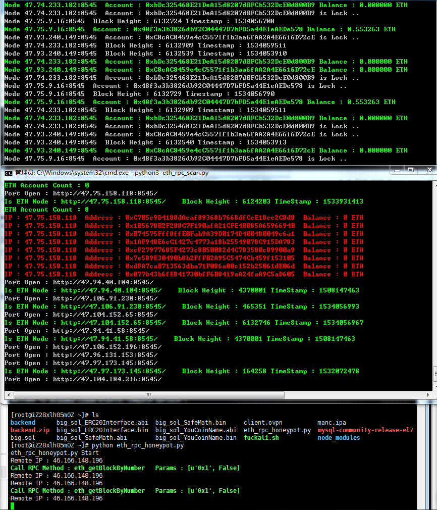

## ETH RPC steal tool

The Etherum RPC Steal toolset .Get More Information Access Link : https://paper.seebug.org/656/ .

Tool Running Example :

### eth_rpc_scan.py

Etherum RPC Node Scanner .

Envirment : **Python 3.7**

Dependency : **requests,web3py**

Using : python3 eth_rpc_scan.py network_session [node_port]

Example : python3 eth_rpc_scan.py 47.74.0.0/11

### eth_rpc_monitor.py

Etherum RPC Node Steal Tool .

Envirment : **Python 3.7**

Dependency : **web3py**

Using : python3 eth_rpc_monitor.py [node_ip_list_file]

Example : python3 eth_rpc_monitor.py scan_data_1534074099097.txt

### eth_rpc_cli.py

Dispatch the Steal Task to eth_rpc_monitor.py .

Envirment : **Python Anything**

Dependency : Nothing

Using : python eth_rpc_cli.py ip [ port ]

Example : python3 eth_rpc_cli.py 127.0.0.1

## ETH RPC honeypot

Etherum RPC honeypot node for collect Attacker information .

Envirment : **Python Anything**

Dependency : **Tornado ,requests**

Using : python eth_rpc_honeypot.py

